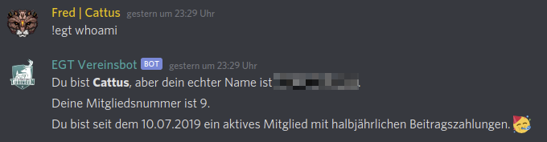

egt-vereinsbot
==============

Der Discord-Vereinsbot für Elysium Gaming Tübingen e.V. mit easyVerein-Anbindung.  

# Usage
```sh-session
$ egt-vereinsbot (-v|--version|version)
$ egt-vereinsbot --help [COMMAND]
USAGE
  $ egt-vereinsbot COMMAND
...
```

# API Keys
You need to pass the tokens for EasyVerein and the discord bot as environment variables.
```bash
EASYVEREIN_TOKEN=easyverein-api-token BOT_TOKEN=discord-bot-token ./bin/run bot
```
Eventually you will handle this with [pm2](https://pm2.keymetrics.io/) since the bot should always run.

# CLI Commands
* egt-vereinsbot bot

# Bot Commands
`!egt hi|hallo|moin|...`  
Just a random greeting.  


`!egt whoami`  
Shows user's membership information resolved from EasyVerein API.  


